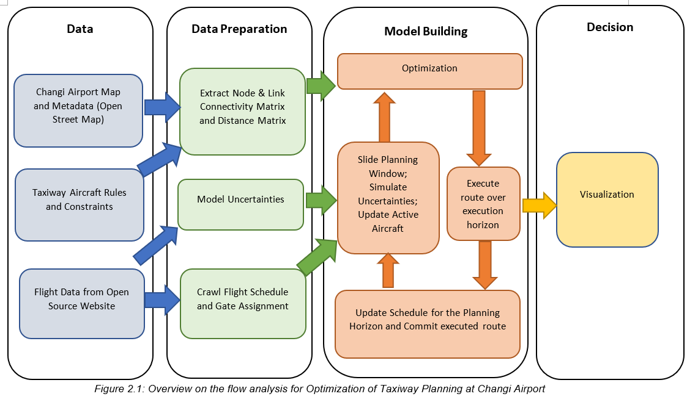
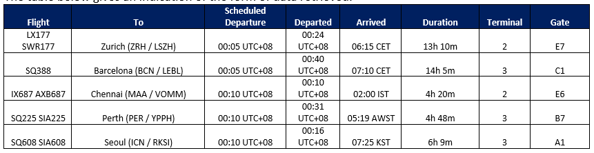
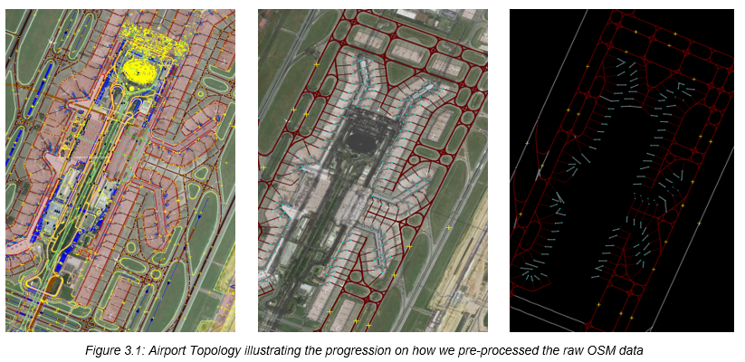
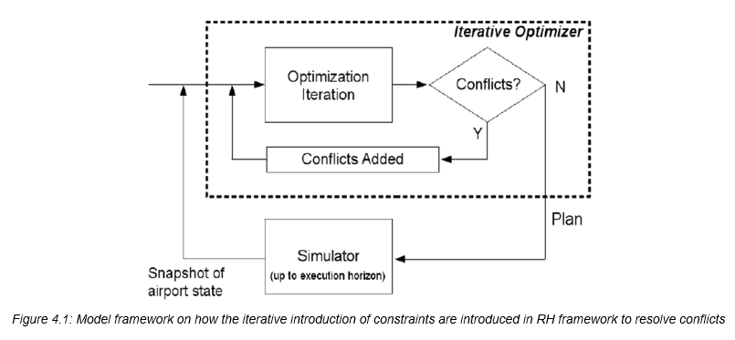
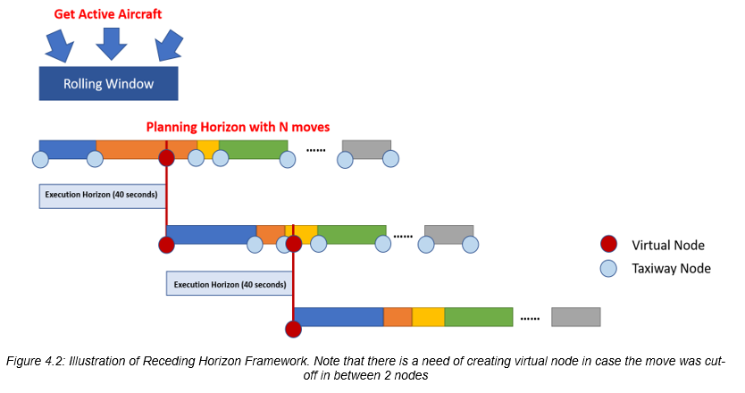
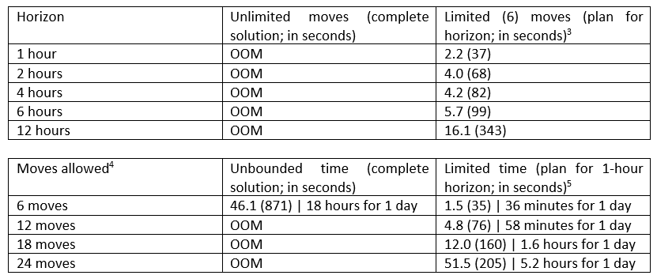

# changi-airport-taxiway-planning

This is the final group project for ISS606 AI Planning & Decision-making module at Singapore Management University for my Master of IT in Business program. I was the main contributor of the project. 

## Introduction
As one of the busiest international airports in the world, Changi Airport sees on average 7,400 flights every week —more than one thousand flights every day. Last year, these flights served more than 68 million passengers and have only increased in number over the last several years. However, Changi Airport has a total capacity to serve 85 million passengers, a limit the airport is rapidly approaching given a consistent rate of growth of more than five percent year-on-year . The trend would see the airport’s 85 million passenger capacity surpassed by 2024, well before the fifth terminal’s opening in 2030, which would add capacity for 70 million passengers. In this report, we propose examining the air transport system to find optimization opportunities for creating additional capacity and as a safeguard against exceeding current capacity.

Congestion on the airport surface is a major constraint to the available capacity of the air transport system. At Changi, the congestion of the two primary runways have increased significantly, commensurate with the increase in served passengers. Long take-off and arrival queues form as a result especially during peak hours. Further, airlines have been turned away from using Changi Airport as current capacity does not seem able to accommodate. Hence, this seems to be an area ripe for refining the optimization of air traffic.

## Problem
We want to solve the coupled routing and timing optimization problem in taxiway planning. There are many individual constraints such as push-back times, taxiway layouts, and separation rules all requiring considerations. The dynamic nature of this problem requires planning to be updated regularly. We propose to formulate the optimization problem in a Receding Horizon scheme, meaning that a plan is implemented in small execution horizons, before re-planning occurs.   

We will have Changi Airport surface modelled as a graph containing nodes, each representing a junction of taxiways. We will construct the connectivity and distance matrix between nodes. Active aircrafts are then modelled as points moving along the arcs, subject to speed limit. Each aircraft moves from its origin node to its destination node, while observing taxiway rules.   

The decision variables are therefore  
1) the node at which an aircraft begins its kth move  
2) the time at which an aircraft starts its kth move.   

The objective is to minimize a weighted combination of total taxi time of all aircrafts and their total taxi distance. We will use Mixed Integer Linear Programming and CPLEX to solve the optimization problem. As taxiway planning is coupled with runway scheduling and other operations, we made assumptions to simplify the problem in order to define a realistic scope given the time constraint. 

## Data Gathering and Processing
We gathered two data sets required to solve this problem: 
1)	Flight data; and 
2)	Changi Airport surface.

### Flight Data
Due to current limitation of our flight schedule, we need to find a different source to capture the real average flow of air traffic in Changi Airport. We scraped the flight data from Flight Era. The data included necessary flight information which will be used for model simulation:
•	Flight number
•	Destination
•	Scheduled departure and arrival times
•	Actual departure time
•	Arrived (Boolean)
•	Flight duration
•	Terminal
•	Gate (if departing) 

The table below gives an indication of the form of data retrieved.

### Changi Airpot Surface
We utilized the Changi OSM file available from Open Street Map and performed the following steps to reconstruct the Changi Airport Surface:
1.	Extract relevant nodes: gates, taxiways, runways, holding positions and parking positions
2.	Map terminal gates to parking positions 
3.	Build connectivity between nodes and calculate distance using coordinates (latitude/longitude). These connected nodes are used to created predecessor matrix and forms the edge of the graph
4.	Calculate angles between these edges 

## Model and Algorithm
Our baseline algorithm will start off by calculating the shortest path using Dijkstra's algorithm. This will incorporate the original flight schedule set out, meeting all constraints introduced. There are multiple reasons that may cause delay regarding flight departure or arrival and these changes are then incorporated to provide an updated schedule use of taxiway and runway. To accommodate the dynamic changes in our scheduling, we will be utilizing the Receding Horizon formulation and the use of iterative introduction of constraints to allow the scalability of the baseline algorithms. 

RH formulation enables near real-time operation as the computation is spread between horizons preventing unnecessarily detailed plans being calculated for the distant future. RH scheme is implemented in small execution horizons where single large planning problem is approximated as a sequence of smaller problems. This breaks down the problem into subsets determined by the execution horizon set out in the model. The conversion to RH does however result in an approximation to the globally optimal solution, although this is shown to be relatively small.

Domains
We have organized the domains for the model into four categories, each of which have their own section.

Time
Let H represent the planning horizon (e.g. 4 hours), and both k and j represent the planning periods, which may vary in duration. The movement of the aircraft is divided into a sequence of K moves. Thus, each aircraft’s plan is for a different length of time. We need to set an execution horizon that is lower than the planning horizon of each aircraft. 

Airport Graph
The airport graph structure contains N nodes, with each node represented by n and m, their connectivity by matrix C(n, m), their length by L(n, m), and the shortest path between nodes n and m in SP(n, m). G denotes the set of all terminal gates, n_arr denotes an arrival runway node, and n_dep denotes a departure runway node.

Aircraft
Let a, b, and c identify the aircrafts, and A as the set of set of all active aircrafts—those which already started taxiing or can start taxiing relative to its origin time—in the planning horizon H, A_arr as the set of all active arrival aircraft in H, and A_dep as the set of all active departure aircraft in H. Augmenting the time domains, t0(a) represents origin time of aircraft a, t_start(a) represents the universal time at which aircraft a started taxiing, and tD(a) represents the time slot at which aircraft a reaches its destination. Augmenting the airport graph domains, d(a, b, n) represents the temporal separation required between aircraft a and b at node n, V(a) represents the maximum speed limit for aircraft a, n0(a) represents the origin node of aircraft a in the current horizon H, nD(a) represents the destination node of aircraft a, and nF(a) represents the final node of aircraft a at the end of the horizon H. 

The universal start time is the scheduled departure time for a departure flight and the scheduled landing time for an arrival flight. An aircraft is modelled as a point moving along the arcs, subject to a maximum speed limit V(a). No aircraft is permitted to move until after its origin time t0(a). In the first planning horizon H, the origin time is the same as t_start(a), whereas in the subsequent horizons, the horizon start time is used. 

Intermediate Parameters
Some intermediate parameters enable the model to work correctly. Virtual node V(a) enables aircraft a to be tracked when transiting between two nodes. The last aircraft to visit node n prior to current horizon is tracked by aL(n). The time at which node n was last visited prior to current horizon is similarly tracked by tL(n). To connect information across horizons, T_taxi(a) retains the time aircraft a taxied prior to current horizon, and L_taxi(a) retains the distance taxied by aircraft a prior to current horizon

Decision Variables:
Let the decision variable R(a, k) denote the node at which aircraft a is begins its kth move (kth planning period), and decision variable T(a, k) denote the time at which aircraft a passes the node in its kth move.

Objective function
The objective function aims to minimize the total taxing time and distance traveled by the aircraft from gates to runway (vice versa)

w1 * (∑_(a=1)^(N_a)▒(t_D (a)-t_start (a))         						
---- taxi time 
+ w2 * (∑_(a=1)^(N_a)▒∑_(k=2)^((N_k-1))▒∑_(n=1)^(N_n)▒∑_(m=1)^(N_n)▒〖L(n,m)X(a,n,m,k)+r_ST (m,a)X(a,n,m,(N_k-1))〗    	
---- distance travelled

where w1 and w2 are weights provided to determine which is more important. In the case of our model, we prioritize taxi time over distance traveled, yielding w1 = 5 > w2 = 3.

Constraints
Initialization
∀a∈A,n∈N: 
 	X(a,n,m,k)≤C(n,m) ∀m∈N,k∈{2,…,N_k-1}

Continuity
∀a∈A,n∈N:
 	∑_(m=1)^(N_n)▒X(a,n,m,k) =∑_(m=1)^(N_n)▒〖X(a,m,n,k-1) ∀k∈{2,…,N_k-1} 〗

Must have a plan if active
∀a∈A,n∈N:
 		∑_(n=1)^(N_n)▒∑_(m=1)^(N_n)▒X(a,n,m,k) =1 ∀k∈{1,…,N_k-1}

Consistent destination plans
∀a∈A,j∈{2,…,N_k-1}:
 		 T(a,N_k )≤T(a,j)+M(1 - ∑_(m=1)^(N_n)▒X(a,m,n_D (a),(j-1)) )

No turnarounds
 ∀a∈A,n∈{1,…,N_n-1},m∈{(n+1),…,N_n }:
 		 ∑_(k=1)^((N_k-1))▒X(a,n,m,k) +∑_(j=1)^((N_k-1))▒X(a,m,n,j) ≤1

No speeding
∀a∈A,k∈{2,…,N_k-1}:
 		T(a,k)+  (∑_(n=1)^(N_n)▒∑_(m=1)^(N_n)▒L(n,m)X(a,n,m,k) )/V(a) ≤T(a,k+1)

Avoid wake vortex / Standard Instrument Departure
∀{a,b,n}∈〖SE〗_i, k∈{1,…,N_k-1},j∈{1,…,N_k-1}:
 D_SE ({a,b,n},k,j)=1⟹
 		T(a,(j+1))≥T(b,(k+1))+ d_t (b,a,n)-Mg_SE ({a,b,n})
 		T(b,(k+1))≥T(a,(j+1))+ d_t (a,b,n)-M(1-g_SE ({a,b,n}))

## Results
The results show that breaking down the global scheduling problem into various horizons allows us to accommodate changes in scheduling instantly. Minimizing the value of the execution horizon allows us to capture dynamic changes more quickly. Thus, this results to a more real-time planning for the entire planning horizon and by breaking down the schedule into smaller horizons, it helps us achieve an approximation to the global optimal solution.

To better indicate the computational savings achieved, we attempted to run the model for the whole day, including all aircraft at their respective departure times and their full path to the end nodes. The model consistently ran into an Out-Of-Memory (OOM) error, even until we reduced the time horizon to only one hour. This contrast suggests that attempting to solve the problem at scale in a single computation is not only inefficient but potentially impracticable. Hence, the Receding Horizon framework enabled the problem to be solved both practicably and efficiently.

In the Receding Horizon framework, it could be viewed that the single horizon computation times are at the lowest end of the range of Iterative solve times. This becomes more evident when the number of aircraft increases and the number of changes to accommodate becomes more significant. The ability of the RH’s rolling window scheme to spread the computation between horizons becomes more significant in larger problems since it allows the model to concentrate in solving the near future, using approximations for the full scheduling solution. This approach allows us to make it more scalable and adaptable.

## Lessons Learnt
While there are numerous improvements that can be made to the model, including the introduction of an SAA component to simulate the randomness of delays, the current model offers some insight into the way that large optimization problems can be solved.

First, the approach to solving this problem shows that meaningful gains in efficiency can be achieved even without the use of heuristics. Methods for breaking down a problem into components that need to be immediately solved seem intuitive and more explainable than heuristic approaches. Of course, the use of heuristics are not mutually exclusive to these approaches and could provide even quicker access to route planning should the need for larger horizons arise.

In this project, we have used the receding horizon approach to improve the scalability of optimization in an iterative manner. The potential of the algorithm has been illustrated using one-day worth of departure flights ground movement at Changi Airport. What’s more, the use of iteration of the conflict constraints can reduce solve time significantly, while maintaining globally optimal solutions. RH formulation suited well for the dynamic nature of airport taxiway planning as information comes in continuously and uncertainties are common. 

Future works may include optimizing for both arrival and departure aircraft and with coupled problem of runway planning and gate assignment. Further research can be dedicated in performing more close-loop control to aircraft rescheduling in response to disturbances (e.g. runway or parking positions are unusable for some unforeseen circumstances). We can also look at other metaheuristic approaches and algorithms and compare the result and determine if it is possible to integrate them to enhance the real-time traffic control framework.
